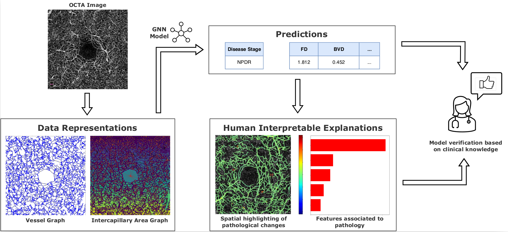
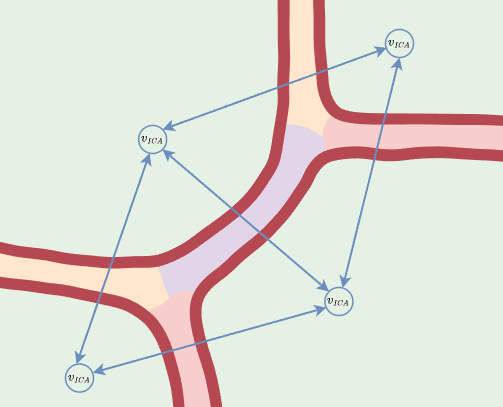

# Evaluating graphs as interpretable data representations of OCTA images for disease staging and biomarker prediction in ophthalmology

## Graph Representations

We present and evaluate two graph representations of OCTA images.

- **Vessel Graphs**
- **Intercapillary Area Graph**

The basis of both representations is a high-quality segmentation map. In vessel graphs, the nodes represent vessel segments that end either at a bifurcation point or at the end of a vessel. Edges are introduced if two vessel segments are connected through a bifurcation point. The intercapillary area contains the intercapillary areas as nodes. It connects intercapillary area nodes through edges if they are separated by just a single pixel of a vessel centerline (skeletonized segmentation map). The vessel segmentation is based on the work by Kreitner et al. [1]. The skeletonization and bifurcation graph extraction, which is the basis for the graph representations is performed using the worky Drees et al. [2].

Vessel Segmentation            |  Vessel Graph             |  Intercapillary Area Graph
:----------------------------:|   :----------------------------:   |:----------------------------:
  |       |  

## Prediction and Interpretation
The models we employ to process the proposed data representation can be found in models/homogeneous_gnn.py. We use Pytorch Geometric [3] for the GNN implementations. GNNs can be employed for biomarker prediction tasks (regression) and disease staging tasks (classifcation) such as diabetic retinopathy staging. The example below show the explanations that can be generated using integrated gradients for spatial importance of specific vessel and their characteristics.

Important vessels for the classification (Diabetic Retinopathy Stage: PDR)            |  Important vessels characteristics for the classification
:----------------------------:|   :----------------------------: 
  |  

## Usage

### Installation of required packages in a virtual environment

1.) Download venv package virtual environment (venv): python3 -m pip install --user virtualenv

2.) Create a virtual environment: python3 -m venv venv

3.) Activate virtual environment: source venv/bin/activate

4.) Use requests to install required packages: pip install -r requirements.txt

### 

The folder demo_data contains an example graph representation for each graph type; checkpoints are stored in the checkpoints folder.
The two "..._demo.py" files show how the graph representations combined with GNNs can be used to predict disease stage/biomarkers combined with interpretable explanations.

## References
[1] Vessel Segmentation Kreitner et al. [[code](https://github.com/KreitnerL/OCTA-graph-extraction/tree/master)][[paper](https://ieeexplore.ieee.org/abstract/document/10400503)]

[2] Skeletonization + Vessel Graph Drees et al. [[code](https://zivgitlab.uni-muenster.de/d_dree02/graph_extraction_evaluation)][[paper](https://link.springer.com/article/10.1186/s12859-021-04262-w)]

[3] Pytorch Geometric: [[code](https://github.com/pyg-team/pytorch_geometric)][[paper](https://arxiv.org/abs/1903.02428)]
